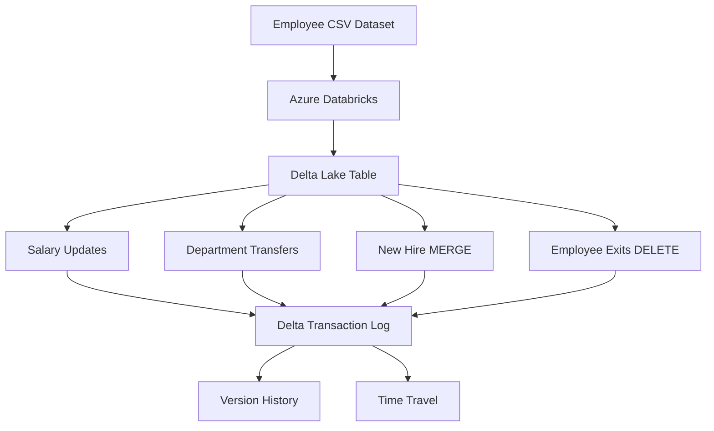
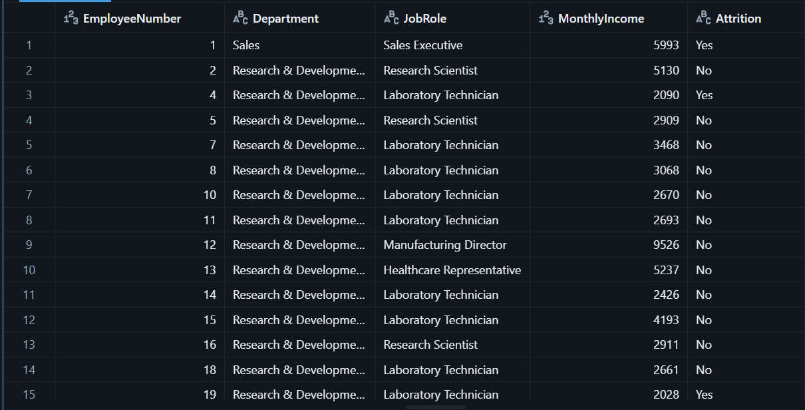
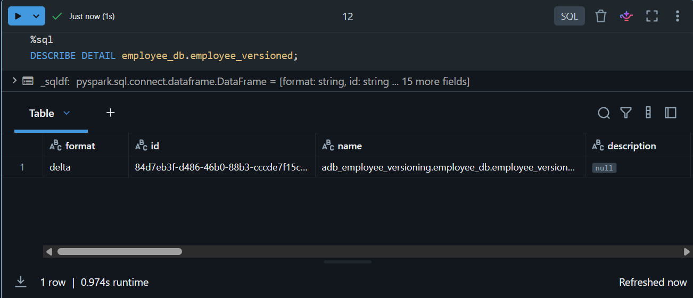
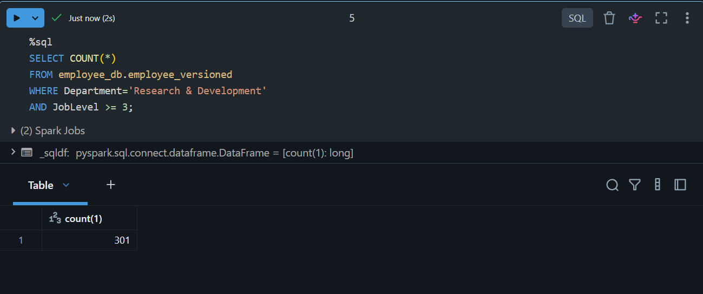
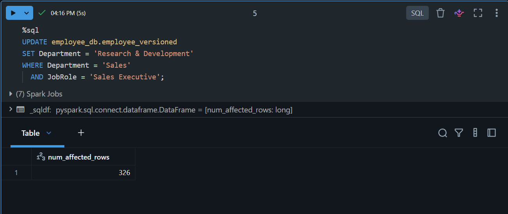
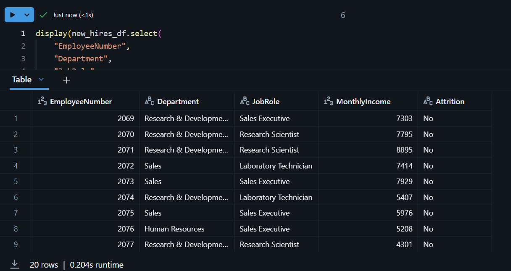
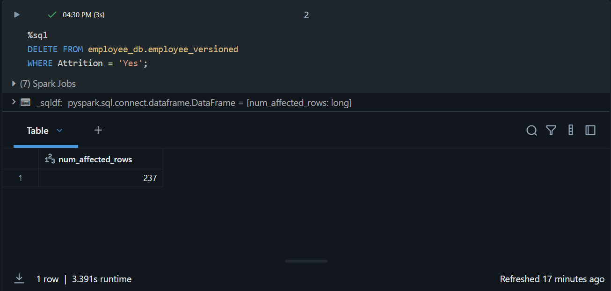
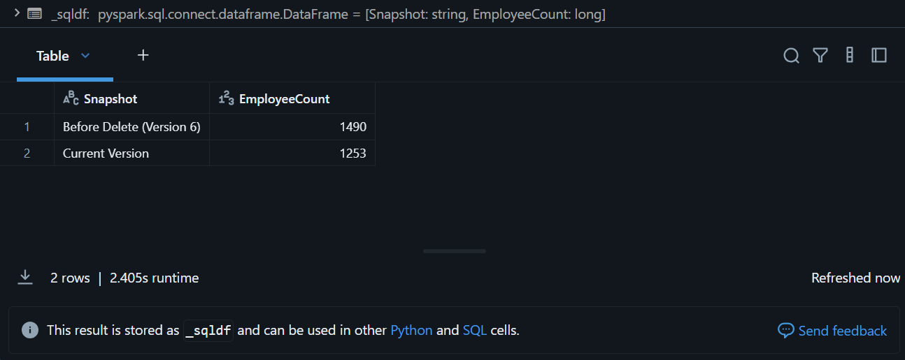
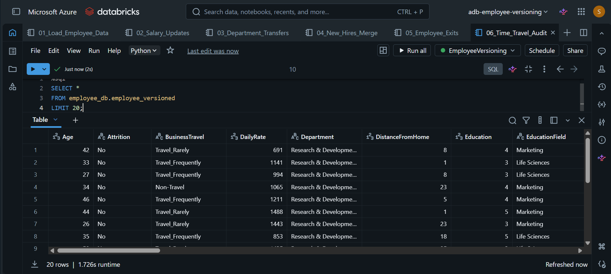

# Employee Data Versioning using Delta Lake

## Overview

This project demonstrates how Delta Lake can be used to maintain versioned employee records in Azure Databricks.

The solution simulates real-world employee lifecycle events such as salary revisions, department transfers, onboarding of new hires, and employee exits while preserving historical versions of data through Delta Lake transaction logs.

The project showcases Delta Lake features including:

- ACID Transactions
- UPDATE
- MERGE
- DELETE
- Version History
- Time Travel
- Auditability

---

## Technologies Used

- Azure Databricks
- Delta Lake
- Apache Spark (PySpark)
- SQL
- GitHub

---

## Dataset

Dataset Source:

IBM HR Analytics Employee Attrition Dataset

Dataset Statistics:

- Records: 1,470 Employees
- Attributes: 35 Columns
- Primary Key: EmployeeNumber

Key Business Columns Used:

- EmployeeNumber
- Department
- JobRole
- MonthlyIncome
- Attrition

---

## Architecture



---

## Project Workflow

### Version 0 – Initial Load

The employee dataset was loaded into Azure Databricks and persisted as a Delta Lake table.

Result:

- Delta Table Created
- Version 0 Generated

---

### Version 1 – Salary Revision Cycle

A salary increase was applied to eligible employees using Delta UPDATE operations.

Features Demonstrated:

- UPDATE
- ACID Transactions

---

### Version 4 – Department Transfers

326 employee records were transferred between departments.

Features Demonstrated:

- UPDATE
- Version Tracking

---

### Version 6 – New Hire Processing

20 new employee records were generated programmatically using PySpark and merged into the Delta table.

Employee Count:

- Before MERGE: 1470
- After MERGE: 1490

Features Demonstrated:

- MERGE
- UPSERT Operations

---

### Version 8 – Employee Exits

Employees with Attrition = 'Yes' were removed from the employee table.

Rows Deleted:

- 237 Employees

Employee Count:

- Before DELETE: 1490
- After DELETE: 1253

Features Demonstrated:

- DELETE
- Delta Versioning

---

## Delta Lake Time Travel

Delta Lake allows querying historical versions of data.

Example:

```sql
SELECT *
FROM employee_db.employee_versioned
VERSION AS OF 6;
```

Results:

- Version 6 Employee Count: 1490
- Current Employee Count: 1253

Deleted records remain accessible through historical versions.

---

## Version History

The Delta transaction log maintains a complete audit trail of all operations.

Operations performed:

| Version | Operation |
|----------|-----------|
| 0 | Initial Load |
| 1 | UPDATE |
| 2 | OPTIMIZE |
| 3 | UPDATE |
| 4 | UPDATE |
| 5 | OPTIMIZE |
| 6 | MERGE |
| 7 | OPTIMIZE |
| 8 | DELETE |

---

## Screenshots

### Dataset Loaded



### Delta Table Created



### Complete Version History


### Salary Update



### Department Transfer



### MERGE New Hires



### Employee Delete



### Time Travel



### Final Employee Table



---

## Key Learnings

- Delta Lake transaction logs
- ACID-compliant data operations
- Delta UPDATE statements
- Delta MERGE operations
- Delta DELETE operations
- Time Travel and Version Recovery
- Historical Auditing
- Azure Databricks Development Workflow

---

## Author

Shreyansh Kumar

B.Tech Computer Science & Communication Engineering

KIIT University
